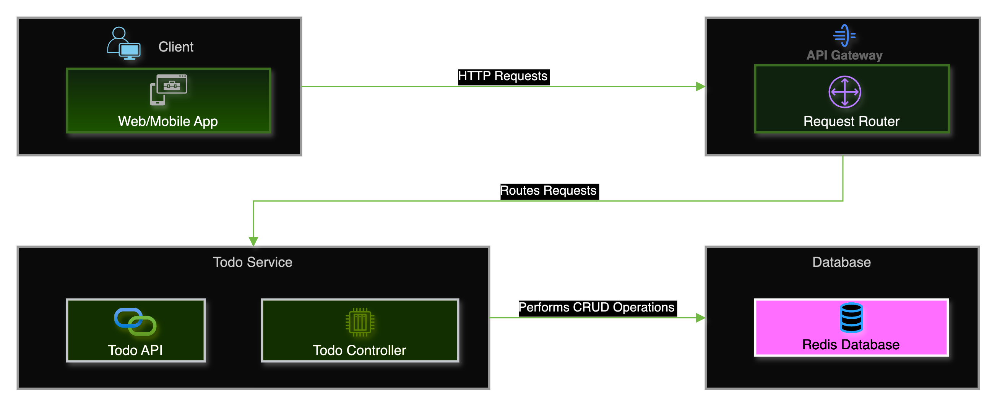

# 🚀 Todo API: Scalable Microservices with Node.js, Redis, and Docker

[](https://github.com/TheToriqul/todo-api-redis)
[](https://github.com/TheToriqul/todo-api-redis/stargazers)


## 📋 Project Overview

The Todo API project is a testament to my skills in designing and implementing scalable microservices architectures. By leveraging the power of Node.js, Express, Redis, and Docker, I have created a robust and efficient backend system for managing tasks in a Todo application.

This project showcases my ability to architect and develop loosely coupled and independently scalable services. It demonstrates my proficiency in utilizing Redis as a high-performance data storage solution, as well as my expertise in containerizing and orchestrating services using Docker and Docker Compose.

Through this project, I have honed my skills in building RESTful APIs, implementing efficient data storage and retrieval mechanisms, and managing seamless communication between services. It highlights my commitment to adhering to industry best practices and creating maintainable, extensible, and performant backend systems.

## 🎯 Key Features

- **Microservices Architecture**: Implemented a modular and scalable microservices architecture for enhanced flexibility and maintainability.
- **API Gateway**: Developed an API Gateway to handle client requests and efficiently route them to the appropriate services.
- **Todo Service**: Built a dedicated Todo Service to manage task creation, retrieval, and deletion operations using Redis as the database.
- **Containerization**: Utilized Docker and Docker Compose to containerize and orchestrate services, ensuring easy deployment and scalability.
- **RESTful API**: Designed and implemented a RESTful API for seamless integration and communication with frontend applications.
- **Efficient Data Storage**: Leveraged Redis as a fast and efficient data storage solution for optimized performance and low latency.

## 🏗️ Project Architecture

The Todo API project follows a microservices architecture, consisting of two main services:

1. **API Gateway**: Acts as the entry point for client requests and intelligently routes them to the appropriate service.
2. **Todo Service**: Handles all operations related to task management, including creation, retrieval, and deletion, using Redis as the underlying database.

<figure >
  <p align="center">
      
      <p align="center">Todo API Architecture</p>
  </p>
</figure>

## 💻 Tech Stack

- Backend:  
- Database: 
- DevOps: 

## 🚀 Getting Started

<details>
<summary>🐳 Prerequisites</summary>

- Node.js (v14 or higher)
- Docker
- Docker Compose

</details>

<details>
<summary>⚙️ Installation</summary>

1. Clone the repository:
   ```bash
   git clone https://github.com/TheToriqul/todo-api-redis.git
   ```
2. Navigate to the project directory:
   ```bash
   cd todo-api-redis
   ```

</details>

<details>
<summary>🎮 Usage</summary>

1. Build and start the Docker containers:
   ```bash
   docker-compose up --build
   ```
2. The API Gateway will be accessible at `http://localhost:5000`, and the Todo Service will be running on `http://localhost:8000`.

3. Interact with the API Gateway to manage tasks:
   - GET `http://localhost:5000/`: Fetch all tasks
   - GET `http://localhost:5000/<task_id>`: Fetch a specific task by ID
   - POST `http://localhost:5000/`: Add a new task
   - DELETE `http://localhost:5000/<task_id>`: Delete a task by ID

For detailed commands and explanations, refer to the [reference-commands.md](reference-commands.md) file.

</details>

## 📚 API Documentation

The Todo API provides the following endpoints for managing tasks:

- `GET /`: Fetch all tasks
- `GET /<task_id>`: Fetch a specific task by ID
- `POST /`: Add a new task
- `DELETE /<task_id>`: Delete a task by ID

For detailed API documentation and request/response examples, please refer to the [API Documentation](docs/api.md).

## 🧪 Testing

The project includes a comprehensive test suite to ensure the reliability and correctness of the Todo API. Tests cover various scenarios, including unit tests, integration tests, and end-to-end tests.

To run the tests, use the following command:

```bash
npm test
```

For more information on the test suite and coverage reports, please refer to the [Testing Guide](docs/testing.md).

## 🚀 Deployment

The Todo API project is designed to be easily deployable using Docker and Docker Compose. The included Dockerfile and docker-compose.yml files provide a seamless deployment experience.

To deploy the project, follow these steps:

1. Ensure Docker and Docker Compose are installed on your deployment environment.
2. Clone the project repository.
3. Navigate to the project directory.
4. Run the following command to build and start the containers:
   ```bash
   docker-compose up --build -d
   ```

For detailed deployment instructions and configuration options, please refer to the [Deployment Guide](docs/deployment.md).

## 📈 Performance and Scalability

The Todo API project is built with performance and scalability in mind. By leveraging Redis as the database and designing the architecture as microservices, the system can handle a high volume of requests and scale horizontally as needed.

Some key performance and scalability considerations:

- Redis provides fast in-memory data storage and retrieval, ensuring low latency and high throughput.
- The microservices architecture allows for independent scaling of services based on demand.
- Docker and Docker Compose enable easy scaling of service instances to handle increased load.

For more information on performance optimization and scalability strategies, please refer to the [Performance and Scalability Guide](docs/performance-scalability.md).

## 🔒 Security

Security is of utmost importance in the Todo API project. The following security measures have been implemented:

- Authentication and Authorization: The API Gateway handles user authentication and authorization using JSON Web Tokens (JWT).
- Secure Communication: All communication between services is encrypted using HTTPS.
- Input Validation: User inputs are validated and sanitized to prevent common security vulnerabilities such as SQL injection and cross-site scripting (XSS).
- Rate Limiting: The API Gateway implements rate limiting to prevent abuse and protect against denial-of-service attacks.

For more information on security best practices and implementation details, please refer to the [Security Guide](docs/security.md).

## 💡 Key Learnings

### Technical Mastery:

1. Microservices Architecture Design
2. Node.js and Express for Building RESTful APIs
3. Redis for Efficient Data Storage and Retrieval
4. Docker and Docker Compose for Containerization and Orchestration
5. API Gateway Pattern for Request Routing and Service Aggregation

### Professional Development:

1. Modular and Maintainable Code Structure
2. Best Practices for Scalable Backend Development
3. Effective Communication and Documentation Skills
4. Problem-Solving and Debugging Techniques
5. Continuous Learning and Adaptation to New Technologies

### 🔄 Future Enhancements

<details>
<summary>View Planned Improvements</summary>

1. Implement User Authentication and Authorization
2. Add Update Functionality for Tasks
3. Integrate a Message Queue for Asynchronous Processing
4. Implement Caching Strategies for Improved Performance
5. Enhance Error Handling and Logging Mechanisms
6. Explore Serverless Architecture for Scalability

</details>

## 🤝 Contributing

Contributions are welcome! If you'd like to contribute to the Todo API project, please follow these steps:

1. Fork the repository.
2. Create a new branch for your feature or bug fix.
3. Make your changes and commit them with descriptive messages.
4. Push your changes to your forked repository.
5. Submit a pull request to the main repository.

For more information on contributing guidelines and best practices, please refer to the [Contributing Guide](docs/contributing.md).

## 📃 License

This project is licensed under the [MIT License](LICENSE).

## 📧 Contact

- 📧 Email: toriqul.int@gmail.com
- 📱 Phone: +65 8936 7705, +8801765 939006
- 🌐 LinkedIn: [@TheToriqul](https://www.linkedin.com/in/thetoriqul/)
- 🐙 GitHub: [@TheToriqul](https://github.com/TheToriqul)
- 🌍 Portfolio: [TheToriqul.com](https://thetoriqul.com)

Feel free to reach out if you have any questions, suggestions, or opportunities for collaboration!

## 🙏 Acknowledgments

- [Poridhi](https://devops.poridhi.io/) for providing comprehensive labs and inspiring this project

---

Thank you for your interest in the Todo API project. I hope you find it valuable and insightful. If you have any feedback or suggestions, please don't hesitate to reach out. Happy exploring and coding! 🚀